#### В приложении существует две сущности: User и Order(заявка)

Главные функции:

- user делает заявки(orders) на депозит и на вывод
- user может смотреть историю своих заявок(orders)
- user может видеть сколько % капает на успешные депозиты(order deposit)

Сущность юзера планируется объединить с сущностью `wallet`.
На этом этапе сущность отделена явно, для того, чтобы не смешивать order с user-ом
Чтобы ордер ничего не знал о юзере. Кроме userId. Связь этих сущностей происходит в features.
Где мы при создании ордера добавляем ID юзера(в данном случае, это telegram ID)

Идея в том, чтобы при изменении одной сущности не ломалась другая сущность.
Удалим order, user не должен ломаться. Удалим user-a, order не должен ломаться.
Чтобы обеспечить низкую связность сущностей FSD предлагает ряд ограничений и правил для достижения этих целей

##### Проектные фичи

- В этом проекте предлагается создавать все jsx/tsx компоненты через ключевое слово `function`
  таким образом подчеркивая важность этого кода.
- Все функции не являюшиеся `jsx/tsx` компонентами, создаем через `() => {}` стрелочные функции.
- Используем `Type` для описания структуры, а `Interface` для имплементации какого-то класса
- Не всегда нужно копировать типы из одной сущности в другую, лучше создать свою, а в дальнейшем пользоваться структурной типизацией от TS
- На страницах(pages) в точке входа можно указать роут через jsdoc, где он используется(смотри пример в pages)
- По возможности сделать комент для компонента или функции. Идея в том, чтобы отобразить цель этого кода, а возможно и мысль которую мы хотели/хотим реализовать
- Оставляейте напоминания(коменты) где осторожным надо быть, или фикс/баги на будущее с помощью плагина [TODO](https://marketplace.visualstudio.com/items?itemName=wayou.vscode-todo-highlight)
- Создавайте publi api(index.ts) файл в модуле, где будет описано, то, что доступно во внешний мир. Всё, что не описано в этом public api, лучше не брать
- Используется плагин [import/order](https://www.npmjs.com/package/eslint-plugin-import), с его помощью сразу видим зону ответственности импортированного файла

```typescript
// For example: Foo.tsx

// основной пакет на котором строиться приложение
import React from 'react'

// импортируем зависимости из внешних установленых пакетов
import { Skeleton } from '@nextui-org/react'
import WebApp from '@twa-dev/sdk'

// импортируем зависимости из других слоев
import { LivePercentCalcCard } from '@/src/features/live-percent-calc-card'
import { useOrderApi, useWithdrawOrderStore } from '@/src/entities/order'
import { isValidDateTime } from '@/src/shared/lib/is-valid-date'
import { texts } from '@/src/shared/constants/texts'

// импортируем зависимости с этого же модуля
import { LinkToHistoryPage } from './link-to-history-page'
```

**Идея в том, чтобы добиться консистентности кода и чтобы коллеги или будущий ты,
быстро понял/ли идею которая закладывается в коде.
Что происходит здесь, зачем и почему именно так. В общем снизить когнитивную нагрузку**

---

### Приложение строиться по методологии [FSD](https://feature-sliced.design)

**Если есть трудность с тем в какой слой расположить новый код.**
Aккумулируй весь код в pages до тех пор пока поставленная задача не будет работать.
Возможно в процессе реализации задачи, ты уже увидишь куда и к чему принадлежит этот код.

#### FSD строиться на основе ответственности

- `app` слой отвечает за инициализацию
- `pages` слой за страницы
- `widgets` слой за виджеты которые используются на разных страницах
- `features` слой за use-cases
- `entities` слой за представление моделей(бизнес сущностей)
- `shared` инфраструктурный код помогающий реализовать приложение

`App, Pages, Widgets` слои сформулированы в терминах интерфейса и меняются по **интерфейсным причинам**

`Features, Entities` слои сформулированы в терминах бизнеса и меняются по **бизнесовым требованиям**

**Слои направлены вниз, от менее устоичивых к самым устоичивым.**

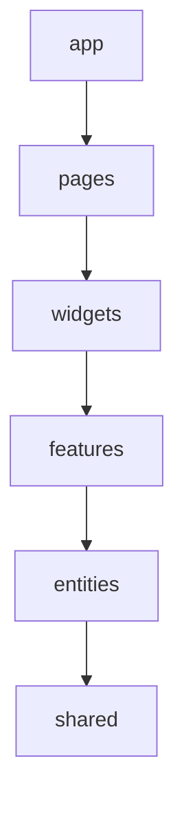

**В слайсе должен быть `public api` - index.ts файл где указано всё, что доступно внешним модулям**
всё, что не экспортируется, снаружи использовать нельзя

---

### Принципы которые реализует FSD

#### Фасад

**Пример плохой реализации:**
Здесь из Feature мы тащим сразу три компонента в Page. Т.к. в этой фиче нету public api. в результате мы получаем
high coupling(высокую связность). Минус в том, что это трудно изменять(поддерживать).
Все компоненты этой фичи могут быть плотно связаны с Page

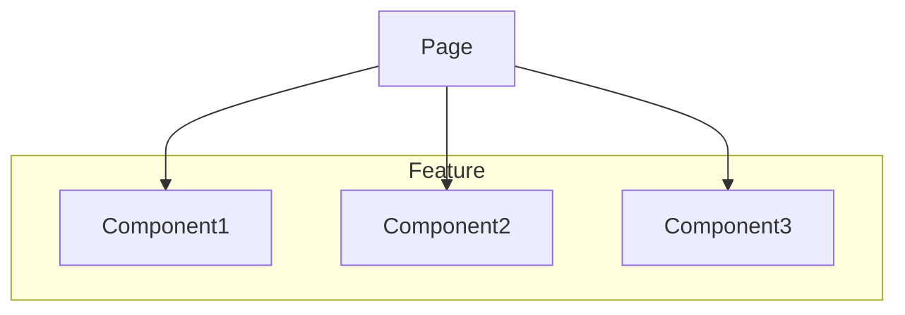

</br>

**Пример хорошей реализации:**
Page имеет доступ только к фасаду. Фасад в контексте react - это общий компонент который объединяет в себе несколько
компонентов. Когда мы прячемся за фасадом, мы добиваемcя low coupling(низкой связности).
Если изменяться требования, мы поменяем фасад. А сами компоненты остануться без изменений. Появляется изменяемость.

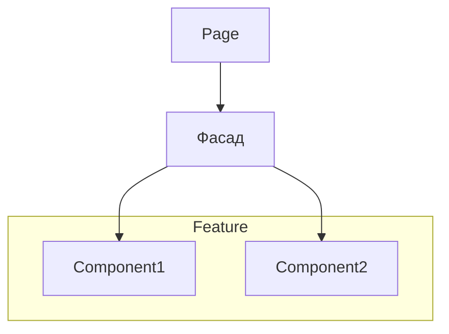

**С помощью фасада мы защищаем внутреннию реализацию от внешних изменений.**

---

#### Принцип ацикличности зависимостей

Циклы в графе зависимостей компонентов недопустимы.

Сущности зависят друг от друга. В FSD это регламентируется тем, что слои нижелажащие не могут импортировать
вышележащие компоненты. Кросс-импорты на уровне одного слоя запрещены. Мы не можем импортировать одну
сущность в другую.

**Пример плохой реализации**

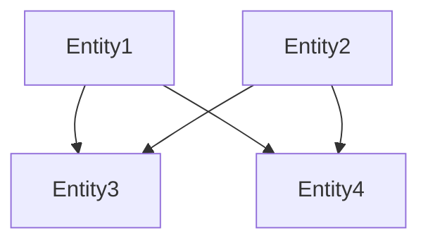

---

#### Принцип устоичивости

Устоичивость - это способность сохранять свое состояние при внешних воздействиях

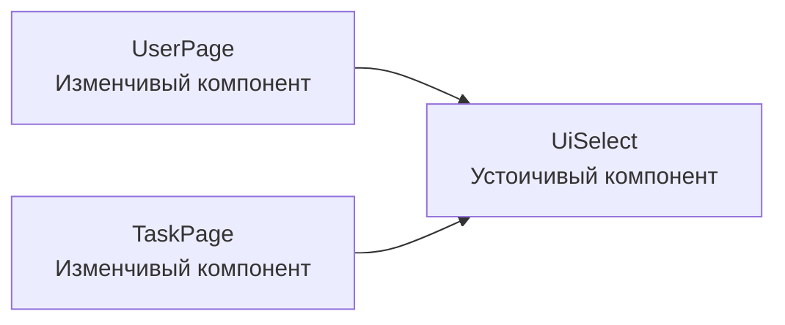

> Зависимости идут в сторону устойчивости. От менее устойчивых компонентов к более устойчивым.

---

#### Dependency inversion

_Не путать с DIP(принципами инверсии зависимостей). В DIP всё реализуется через классы._
_Также не путать с Dependency Injection который помогает разруливать зависимости между классами._

_DIP(принцип инверсии зависимостей) - модули высокого уровня не должны зависеть от
низкоуровневых реализаций, а только от абстракций_

_Dependency Injection - cпособ передавать зависимости извне, а не создавать их внутри_

**Dependency inversion(инверсия зависимостей)** - это когда поток управления не совпадает с потоком зависимостей.

**Поток управления** - это кто кого вызывает

Стандартная ситуация. Когда Module1 использует Module2. Поток управления движется от Module1 к Module2.
Проблема в том, что Module1 зависит от Module2.

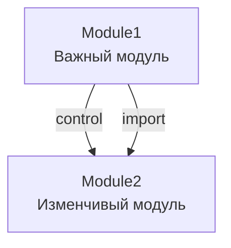

</br>

Module1 создает интерфейс и говорит всем, что через этот интерфейс можете взаймодействовать со мной.
Поток управления остался прежним. Но поток зависимостей теперь изменился. Module1 уже не зависит от Module2.

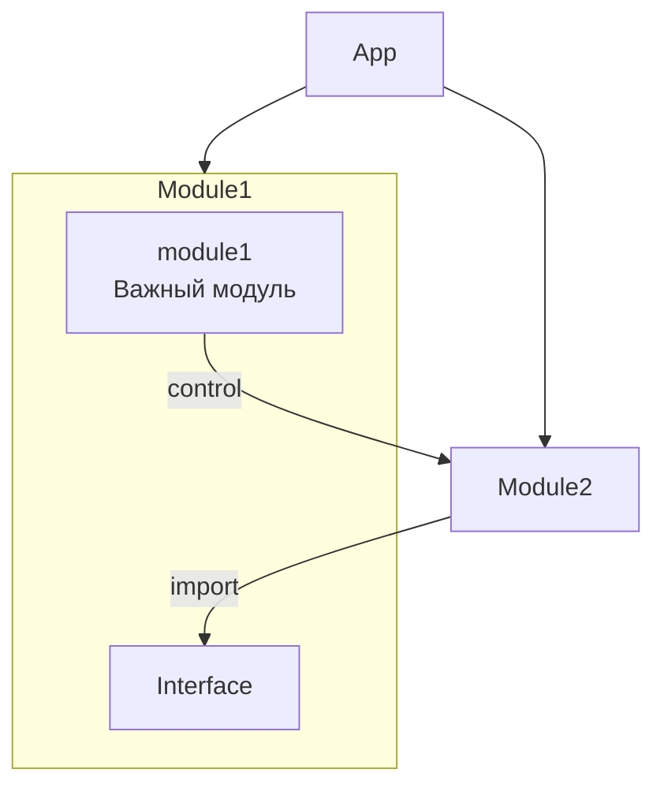

</br>

**Пример плохой реализации:**
В данном случае UpdateUserBtn является features(use case) и начинает зависеть от UserCard и наоборот
UserCard зависит от UpdateUserBtn.

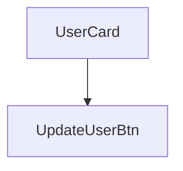

---

**Пример хорошей реализации:**
Таким образом мы защищаем эти компоненты друг от друга(развернули поток зависимостей).
Осознано ограничиваем одни модули от других. Здесь мы передаем UpdateUserBtn внуть UserCard как jsx.
Получается UserCard может ничего не знать о UpdateUserBtn. Кроме того, что это jsx.

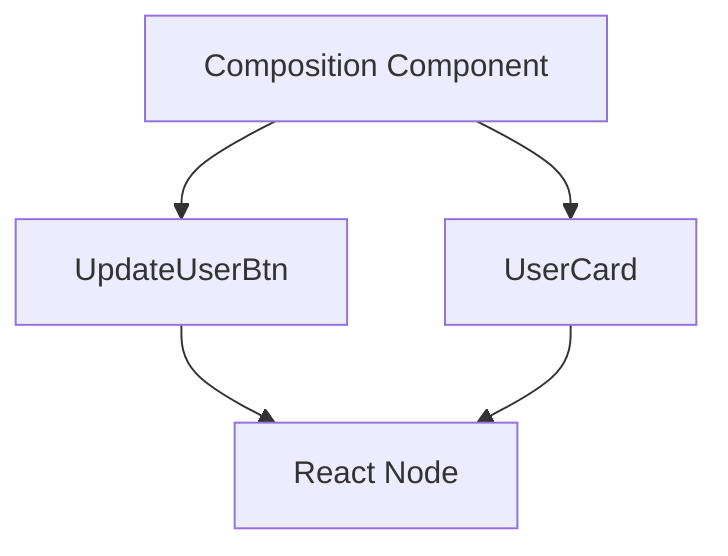

В данном примере мы получили **dependency inversion** где поток управления не совпадает с направлением зависимостей

**Dependency inversion одна из главных возможностей реализовать low coupling и high cohesion**

---

#### Обзор FSD слоёв

#### `app` — изменчивый слой

- **Описание**: определяет конфигурацию приложения и инициализацию.
- **Особенности**:
  - Часто изменяется, является нестабильным.
  - **Импорты из `app` запрещены.**

---

#### `pages` — изменчивый слой

- **Описание**: Явно указывает какие страницы есть в приложении.
- **Особенности**:
  - Если компонент используется один раз, то лучше расположить его в pages, иначе делайте widgets
  - Изменяется по причинам изменения страницы.
  - Mожет содержать много логики отображения.
  - Импорты между страницами запрещены.
  - Не должно быть бизнес логики.
  - Нестабильный слой.

---

#### `widgets` — изменчивый слой

- **Описание**: композиционный слой
- **Особенности**:
  - Позволяет **объединять код, который будет переиспользован на разных pages(страницах)**
  - Используется для объединения функциональности.
  - Без необходимости лучше не создавать.

---

#### `features` — защищенный бизнес слой

- **Описание**: описывает функции приложения в терминах бизнеса(Наприм: сделать покупку, добавить в избранное).
- **Особенности**:
  - **Запрет на импорты между фичами**: отдается приоритет независимости.
  - Если фичи хорошо описаны, создается **"кричащая архитектура"**.
  - Можем совмещать сущности из **entities**
  - Хранит UI-компоненты и их состояние.

---

#### `entities` — защищенный абстрактный бизнес-слой

- **Описание**: определяет модель сущностей и работу с ними.
- **Особенности**:
  - Может включать небольшие(персонализированные для этой сущности) переиспользуемые UI-компоненты.
  - Используются **слоты** и **рендер-пропсы** (чтобы реализовать DI - depedency inversion).
  - **Запрет на кросс-импорты**: связь сущностей осуществляется через верхние слои.
  - Не нужно создавать очень маленькие сущности
  - Описывается в терминах бизнеса.
  - Может содержать CRUD-операции.

---

#### `shared` — устойчивый инфраструктурный слой

- **Описание**: реализует функциональность приложения, не содержит бизнес-логики.
- **Особенности**:
  - Модули стабильны: **закрыты для изменений, но открыты для дополнения**.
  - Можно определять интерфейсы и контексты, а реализовывать их выше.
  - **Public API**: не обязателен, используется для скрытия логики.
  - **Кросс-импорты разрешены**, так как слой устойчивый.
  - Описывается в терминах **"как это делать"**.

---

##### Напоминание: Не дробите сущности, очень мелко

**Идея** в том, чтобы модули имели низкую связность и высокую дружность(как на графике)

Модули с низкой связностью(low coupling) имеют минимальную зависимость друг от друга.
Внутренняя реализация не зависит от внешних реализаций.

Модули с высокой дружностью(high cohesion) имеют сильно связанные, но внутренне скоординированные компоненты.
Все элементы модуля тесно связаны и работают с общими целями или функциональностью. Внутри модуля минимальная необходимость в зависимости от внешних модулей.

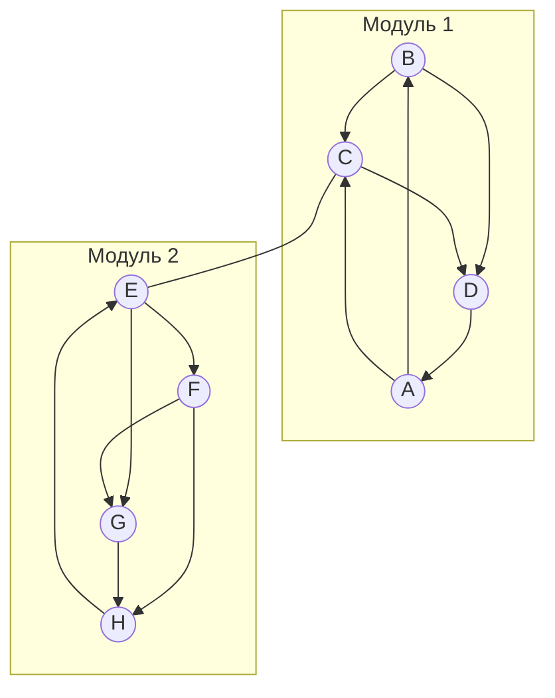

---

> [!CAUTION]
> Пример того, какие модули не нужно создавать

В данном примере модули имеют высокую связность между собой. Минус в том, что нельзя теперь просто так взять
и убрать/изменить модуль из системы не повредив второй модуль. Мы будем вынуждены делать рефактор двух модулей.
Становиться очень сложно поддерживать, масштабировать такие приложения.

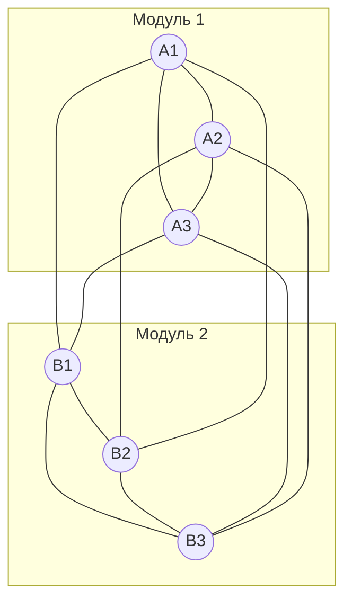

Author: @egnvk
